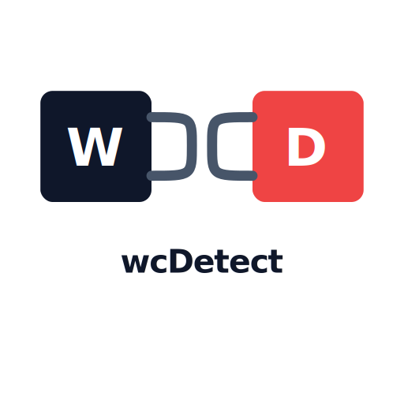

# wcDetect
web cache deception detect


<p align="center">
  
</p>
<div align="center">


</div>

```bash                  
usage: wcdetect.py [-h] [-u URL] [-f URL_FILE] [-H CUSTOM_HEADERS] [-p KNOWN_PATH] [-k KEYWORD]

options:
  -h, --help            show this help message and exit
  -u, --url URL         URL to test [required]
  -f, --file URL_FILE   File of URLs
  -H, --header CUSTOM_HEADERS
                        Add a custom HTTP Header
  -p, --path KNOWN_PATH
                        If you know the path, Ex: -p my-account
  -k, --keyword KEYWORD
                        If a keyword must be present in the poisoned response, Ex: -k codejump
  -hu HUMAN, --human HUMAN
                        Performs a timesleep to reproduce human behavior (Default: 0s) value: 'r' or 'random'

```
### Arguments

```bash
# With multiple headers
» ./wcdetect.py -u https://0a4f00ae0447a9ce801a03a500ea0097.web-security-academy.net/ -H "Cookie: session=OocpsiwqB6XOUkBkBDuqEHUb2BxYEvbC" -H "x-forwarded-host: toto"

# With specific keyword and path
» ./wcdetect.py -u https://0a4f00ae0447a9ce801a03a500ea0097.web-security-academy.net/ -H "Cookie: session=OocpsiwqB6XOUkBkBDuqEHUb2BxYEvbC" -p my-account -k wiener
```

## Examples


## Features

- Path traversal confusion
- Testing multiple payloads and extensions (modules/payloads.py)

## Informations

If you want to test the script:
- https://portswigger.net/web-security/web-cache-deception

To retrieve the session cookie quickly and easily:
- https://cookie-editor.com/

If you want to add payloads or other items
- modules/payloads.py